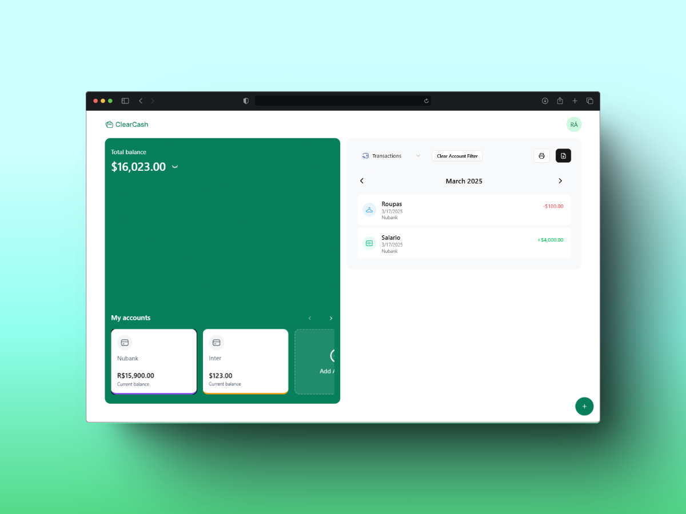

<p align="center">
   
</p>

<h1 align="center">
    <a href="#">ClearCash</a>
</h1>

<p align="center">
    ClearCash is a financial management application designed to help users track expenses, manage budgets, and gain financial insights with ease.
</p>

<p align="center">
  <a href="https://github.com/rafael-bit/clearcash">
   	
  </a>
</p>

# 🚀 How It Works

ClearCash enables users to efficiently manage their financial activities with features such as budget tracking, expense categorization, and insightful data visualization. It integrates authentication, email notifications, and customizable themes for a seamless user experience.

## 👷 Running Locally

#### Clone the repository

```bash
git clone https://github.com/rafael-bit/clearcash
```

#### Install dependencies and run the application in development mode

```bash
npm install
npm run dev
```

Open this address in your browser: [ClearCash](http://localhost:3000/)

# 💻 Technologies

- [Next.js](https://nextjs.org/)
- [TypeScript](https://www.typescriptlang.org/)
- [Tailwind CSS](https://tailwindcss.com/)
- [Shadcn](https://ui.shadcn.com/)
- [Drizzle ORM](https://orm.drizzle.team/)
- [Neon Database](https://neon.tech/)
- [NextAuth.js](https://next-auth.js.org/)
- [Prisma](https://www.prisma.io/)
- [React Hook Form](https://react-hook-form.com/)
- [Resend](https://resend.com/)

# 🚩 Bugs

Feel free to **report a new issue** with an appropriate title and description.

# 💡 Author

- Rafael Áquila ([@rafael-bit](https://github.com/rafael-bit))

# 🔧 Contributing

Check the [contribution page](https://github.com/rafael-bit/clearcash/) to see the best places to report issues, start discussions, and contribute.